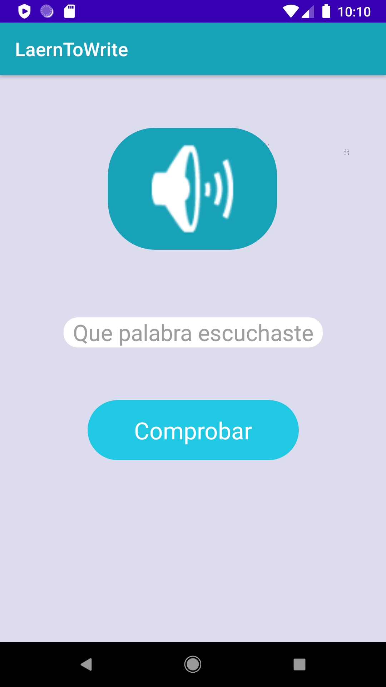
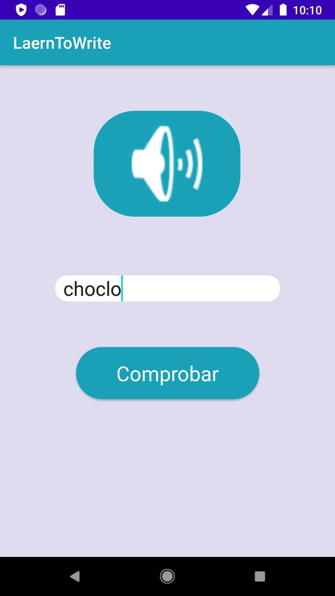
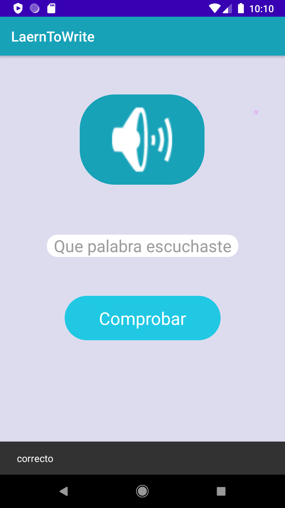

# LearnToWrite
<h2>Aplicacion para niños, para aprender a escribir lo que escucha</h2>

<h2>no se puede comprabar si no se ha ingresado una palabra</h2>

<h2>La verificacion es tanto textual como auditiva</h2>

